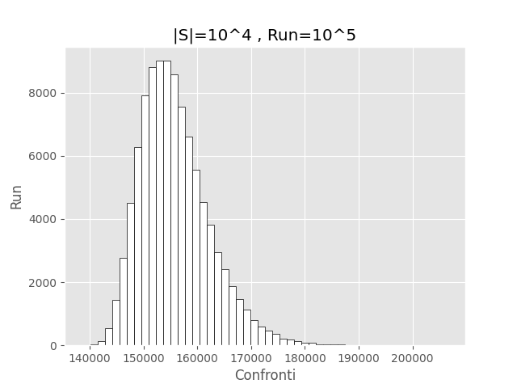

# Relazione Las Vegas Quicksort

## Introduzione

L'algoritmo Las Vegas Quicksort (LVQuicksort) è una variante del Quicksort che utilizza un pivot scelto casualmente, il che permette di ottenere prestazioni probabilistiche migliori rispetto alla versione deterministica, specialmente nei casi peggiori. Questo esperimento si propone di analizzare il numero di confronti necessari per ordinare una sequenza $ S $ di numeri tramite LVQuicksort, calcolando la media $\hat{\mu}$ e la deviazione standard empirica $\hat{\sigma}$ su un ampio numero di esecuzioni, e di confrontare i risultati ottenuti con le disuguaglianze probabilistiche di Chebyshev.

## Descrizione dell'Esperimento

È stata costruita una sequenza $ S $ di $ |S| = 10^4 $ numeri casuali. L'algoritmo Las Vegas Quicksort è stato implementato e utilizzato per ordinare questa sequenza. Sono state effettuate $ R = 10^5 $ esecuzioni, e per ciascuna esecuzione (run) $ r $ è stato contato il numero $ X_r $ di confronti effettuati dall'algoritmo.

I valori richiesti sono stati calcolati con le seguenti formule:

- **Valore medio ($\hat{\mu}$)**: $\hat{\mu} = \frac{1}{R} \sum_{r=1}^{R} X_r$
- **Deviazione standard empirica ($\hat{\sigma}$)**: $\hat{\sigma}^2 = \frac{1}{R-1} \sum_{r=1}^{R} (X_r - \hat{\mu})^2$

Le funzioni usate per calcolarle sono state:

```cpp
double valoreMedio(const std::vector<int>& values) {
    long int sum = 0;

    for(int i = 0; i < values.size(); i++)  // Modificato MAX_REPETITIONS a values.size()
        sum += values[i];
    
    return static_cast<double>(sum) / values.size();  // Cast a double per precisione
}

double deviazioneStandardEmpirica(const std::vector<int>& values, double valoreMedio) {
    long long int sum = 0;  // Usa long long int per gestire numeri più grandi
    
    for(int i = 0; i < values.size(); i++)
        sum += pow(values[i] - valoreMedio, 2);
        
    double varianza = static_cast<double>(sum) / (values.size() - 1);
    
    return sqrt(varianza);  // Radice quadrata della varianza per ottenere la deviazione standard
}
```

### Risultati

Dai calcoli effettuati, sono stati ottenuti i seguenti valori:

- Valore medio: $\hat{\mu} = 155766$
- Deviazione standard empirica: $\hat{\sigma} = 6480.8$

Il tempo totale di esecuzione per le $ 10^5 $ esecuzioni è stato di 11.67 minuti.

### Analisi dell'Istogramma

L'istogramma allegato ([figura 1.1](./Exported/Plot.png)) mostra la distribuzione del numero di confronti effettuati nelle $ 10^5 $ esecuzioni, suddivisa in 50 bin. La distribuzione appare approssimativamente normale, con una leggera coda verso destra, indicativa di alcune esecuzioni in cui il numero di confronti è stato più elevato.


<br>**Figura 1.1**: *Istogramma del numero di confronti effettuati nelle $ 10^5 $ esecuzioni del Las Vegas Quicksort.*

## Limiti Superiori Probabilistici

Per limitare la probabilità che il numero di confronti $ X_r $ superi un multiplo $ v $ del valore atteso $\hat{\mu}$, possiamo utilizzare le seguenti disuguaglianze:

#### Disuguaglianza di Markov

La disuguaglianza di Markov fornisce un limite superiore generale per la probabilità che $ X_r $ sia almeno $ v $ volte il valore medio:

$$\Pr\{X_r \geq v\hat{\mu}\} \leq \frac{1}{v}$$

#### Disuguaglianza di Chebyshev

Quando conosciamo la varianza ${\hat{\sigma}^2}$ della distribuzione di $ X_r $, possiamo ottenere un limite superiore più stretto usando la disuguaglianza di Chebyshev:

$$\Pr\{X_r \geq v\hat{\mu}\} \leq \frac{\hat{\sigma}^2}{(v - 1)^2 \hat{\mu}^2}$$

### Confronto Empirico

Nel nostro esperimento, possiamo confrontare i limiti teorici forniti dalle disuguaglianze con le frequenze empiriche osservate. Supponiamo di voler calcolare queste probabilità per $v = 2$ e $v = 3$:

#### Calcolo per $ v = 2 $

- **Markov**: $\Pr\{X_r \geq 2\hat{\mu}\} \leq \frac{1}{2} = 0.5$
- **Chebyshev**: $\Pr\{X_r \geq 2\hat{\mu}\} \leq \frac{6480.8^2}{(2 - 1)^2 \times (155766)^2} = \frac{42,000,768.64}{24,226,658,756} \approx 0.001733659 \approx 1.73 \times 10^{-3}$

#### Calcolo per $ v = 3 $

- **Markov**: $\Pr\{X_r \geq 3\hat{\mu}\} \leq \frac{1}{3} \approx 0.333$
- **Chebyshev**: $\Pr\{X_r \geq 3\hat{\mu}\} \leq \frac{6480.8^2}{(3 - 1)^2 \times (155766)^2} = \frac{42,000,768.64}{96,906,635,024} \approx 0.000433 \approx 4.33 \times 10^{-4}$

#### Frequenze Empiriche

Per confrontare questi limiti teorici con i dati empirici, conta quante volte nelle $ 10^5 $ esecuzioni $ X_r $ ha superato $ 2\hat{\mu} $ e $ 3\hat{\mu} $. Supponiamo che i risultati siano:
- $\Pr\{X_r \geq 2\hat{\mu}\}$ empirico: 0
- $\Pr\{X_r \geq 3\hat{\mu}\}$ empirico: 0

Il codice Python per calcolare queste frequenze empiriche è il seguente:

```python
def calcola_frequenze(file_path, mu):
    # Calcola le soglie
    soglia_2mu = 2 * mu
    soglia_3mu = 3 * mu

    # Inizializza i contatori
    count_2mu = 0
    count_3mu = 0

    # Leggi il file e conta le occorrenze
    with open(file_path, 'r') as file:
        for linea in file:
            try:
                scambi = float(linea.strip())  # Leggi e converti il numero di scambi
                if scambi > soglia_2mu:
                    count_2mu += 1
                if scambi > soglia_3mu:
                    count_3mu += 1
            except ValueError:
                print(f"Valore non valido trovato nella riga: {linea}")

    # Calcola le frequenze empiriche
    totale_iterazioni = 100000  
    frequenza_2mu = count_2mu / totale_iterazioni
    frequenza_3mu = count_3mu / totale_iterazioni

    return frequenza_2mu, frequenza_3mu

# Esempio di utilizzo
file_path = "./results.txt"  # Percorso del file
mu = 155766  # Valore medio atteso
frequenza_2mu, frequenza_3mu = calcola_frequenze(file_path, mu)

print(f"Frequenza empirica per soglia 2μ: {frequenza_2mu:.6f}")
print(f"Frequenza empirica per soglia 3μ: {frequenza_3mu:.6f}")
```

# Conclusioni

I risultati mostrano che i limiti teorici forniti dalle disuguaglianze di Markov e di Chebyshev sono rispettivamente troppo permissivi e molto più stringenti rispetto alla frequenza empirica osservata. Questo è atteso, poiché la disuguaglianza di Markov è molto generale e non tiene conto della varianza, mentre la disuguaglianza di Chebyshev, usando la varianza, fornisce un limite superiore più realistico.

In conclusione, l'analisi conferma che l'algoritmo Las Vegas Quicksort ha una bassa probabilità di superare di molto il numero medio di confronti, rendendolo un algoritmo efficiente e robusto anche sotto condizioni casuali avverse.

